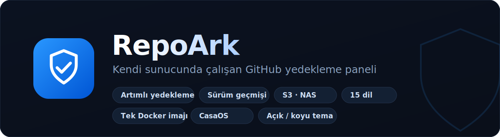

<p align="center">
  
</p>

<p align="center">
  
  
  
  
  
  
</p>

## RepoArk

**Kendi sunucunda çalışan, panelden yönetilen bir GitHub yedekleme aracı.**

GitHub hesabını bir kişisel erişim token'ı (PAT) ile bağlarsın, neyi yedekleyeceğini
seçersin; zamanlayıcı belirli aralıklarla çalışır ve **değişiklik yoksa yedek almaz.**
Repolar bare git aynası olarak saklanır (kendi git geçmişi = sürüm kaydı); star, gist,
issue ve profil verisinin ise tarih damgalı **sürümlü geçmişi** tutulur.

Her şey **tek bir Docker imajında** çalışır — API ve panel aynı konteynerde. Kişisel bir
sunucuda, NAS'ta veya **CasaOS** üzerinde dakikalar içinde ayağa kalkar.

---

## ✨ Öne çıkanlar

**Yedekleme**
- 📦 Repolar (kod), özel repolar, fork'lar, wiki'ler
- ⭐ Yıldızladıkların — liste + isteğe bağlı kod klonu
- 🐛 Issue / PR / yorumlar, 📝 gist'ler, 👤 profil & sosyal graf
- ⏱️ Zamanlanmış **artımlı** yedekleme (cron / aralık / elle)
- 🧠 Akıllı değişiklik tespiti — hiçbir şey değişmediyse çalışmayı atlar
- 🗂️ Sürümlü snapshot geçmişi + canlı ilerleme göstergesi

**Gözat & geri yükle**
- 🔎 GitHub gibi içine gir: dosya ağacı, commit'ler, sürümler, issue/PR okuma
- 🔦 Tüm repolarda dosya adı ve içerik araması
- ⬇️ İndir: repo zip'i, `.bundle`, tek dosya, tüm yedek
- ↑ **GitHub'a geri yükle** — silinmiş bir repoyu yedekten tek tıkla yeniden oluştur

**Depolama & hedefler**
- ☁️ Uzak hedefler: **S3** (AWS · MinIO · Backblaze · Wasabi), **SMB**, **NAS/NFS**, yerel — `rclone` ile artımlı senkron
- 🧹 Saklama politikası (son N snapshot) + disk kullanımı paneli
- 🗄️ **Silinen repo kasası** — GitHub'dan silinen repolar yedekte korunur

**Güven & güvenlik**
- 🔐 Panel giriş şifresi (isteğe bağlı)
- 🩺 Yedek sağlık kontrolü — `git fsck` ile bütünlük doğrulaması
- ⚠️ Proaktif uyarılar: token süresi dolmak üzere / iş üst üste başarısız
- 🔒 Token'lar Fernet (AES-128) ile şifreli saklanır, loglara sızmaz
- 🔔 Bildirimler: e-posta (SMTP) + Telegram

**Deneyim**
- 🖥️ Zengin gösterge paneli: kapsam, boyut grafiği, dil dağılımı, "neler değişti?", yedekleme takvimi (ısı haritası)
- 🏢 Organizasyon desteği · 🧩 kurulum sihirbazı
- 💾 Panel ayarlarını yedekle / geri yükle (taşımada tek dosya)
- 🌍 **15 dil** · 🌗 açık / koyu tema · 📱 mobil uyumlu + PWA (ana ekrana eklenebilir)

---

## 🚀 Hızlı başlangıç

```bash
git clone https://github.com/Coosef/repoark.git
cd repoark
cp .env.example .env          # (isteğe bağlı) port / timezone ayarı
docker compose up -d --build
```

Panel → **http://localhost:8765**

Ardından panelden bir GitHub PAT'i ile hesabını bağla, neyi yedekleyeceğini seç ve
kurulum sihirbazını takip et.

### PAT oluşturma
GitHub → **Settings → Developer settings → Personal access tokens**
Önerilen izinler: `repo`, `gist`, `read:user`, `read:org`.

---

## ⚙️ Yapılandırma

`.env` (hepsi isteğe bağlı):

| Değişken | Açıklama | Varsayılan |
|---|---|---|
| `HOST_PORT` | Panelin dinlediği port | `8765` |
| `TZ` | Zamanlayıcı ve tarihler için saat dilimi | `Europe/Istanbul` |
| `SECRET_KEY` | Sabit Fernet anahtarı (veri hacmini taşırken token'lar çözülebilsin diye) | otomatik üretilir |

Tüm kalıcı durum `./data` altında toplanır:

```
data/
├─ app.db                       # ayarlar, işler, çalışma geçmişi
├─ secret.key                   # token şifreleme anahtarı
└─ backups/<kullanıcı>/
   ├─ current/                  # güncel yedek (bare repolar + metadata)
   └─ snapshots/<tarih>/        # metadata sürüm geçmişi
```

---

## 🏗️ Teknoloji

| Katman | Kullanılan |
|---|---|
| İndirme motoru | [`github-backup`](https://github.com/josegonzalez/python-github-backup) |
| Backend | FastAPI · SQLModel/SQLite · APScheduler · httpx |
| Şifreleme | `cryptography` (Fernet) |
| Uzak senkron | `rclone` (S3 / SMB / yerel) |
| Panel | React 18 · Vite (kütüphanesiz özel i18n + tasarım sistemi) |
| Paketleme | Çok aşamalı tek Docker imajı (Node build → Python serve) |

---

## 🔒 Güvenlik

- GitHub token'ları **hiçbir zaman düz metin saklanmaz** — Fernet ile şifrelenir, loglarda maskelenir.
- Yedeklerin, veritabanın ve şifreleme anahtarın yalnızca **senin sunucunda** (`./data`) durur.
- İstersen panele bir **giriş şifresi** koyabilirsin.
- Bu depo yalnızca kaynak kodu içerir; hiçbir kişisel veri, token veya yedek içermez.

---

## 📄 Lisans

[MIT](LICENSE) — dilediğin gibi kullan, değiştir ve dağıt.
